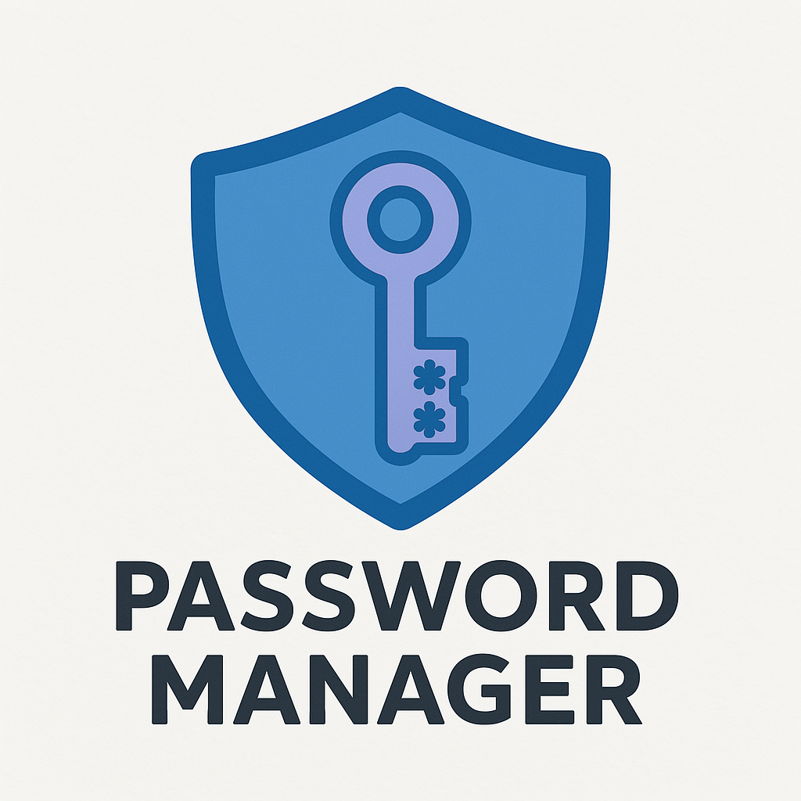

---

### 🔐 `README.md` — PasswordManager (Windows)

```markdown
# 🔐 PasswordManager

*A modern, local-first password manager for Windows with full encryption, smart browser detection, and a sleek GUI.*

 <!-- Swap in your actual logo path -->


---

## ✨ Features

- 🔒 Secure encryption with **Fernet** (AES 128-bit symmetric)
- 🔐 Master password protection with **PBKDF2** (SHA256)
- 🗂️ Encrypted **SQLite** database for credentials
- 🧠 **Real-time browser monitoring** (Chrome, Firefox, Edge)
- 🔄 Smart update detection for existing entries
- 📥 One-click saving of newly detected credentials
- 📝 Support for notes, editable tags, and visibility toggle
- 🎛️ Stylish GUI built with `tkinter` and custom themes
- 🌗 **Dark/light mode** support
- 🔏 Auto-logout after inactivity
- 📋 Copy passwords to clipboard
- 🔧 **Settings dashboard** with:
  - Startup toggle (Windows/Linux)
  - Auto-logout timer config
  - Monitoring options
- 🖥️ Seamless startup with system tray integration (Windows)

---

## 🛠️ Requirements

- Windows 10 or later
- Python 3.6+
- Install dependencies:

```bash
pip install -r requirements.txt
```

**Dependencies**:
- `cryptography` – encryption
- `tkinter` – UI
- `pywin32` – Windows integration
- `pyperclip` – clipboard
- `keyboard` – input monitoring
- `browser-cookie3` – browser integration
- `pycryptodome` – browser password decryption

---

## 🚀 Installation & Usage

```bash
git clone https://github.com/Lintshiwe/PasswordManager.git
cd PasswordManager
pip install -r requirements.txt
python password_manager.py
```

➡️ On your first run, you’ll create a **master password** to secure your vault.

---

## 🧪 How It Works

| Layer          | Stack                                       |
|----------------|---------------------------------------------|
| Language       | Python 3.6+                                 |
| GUI            | Tkinter with custom styling                 |
| Data Storage   | SQLite3                                     |
| Encryption     | Fernet + PBKDF2 via `cryptography`          |
| OS Integration | `pywin32` (Windows)                         |
| Monitoring     | `keyboard`, `browser-cookie3`, `pycryptodome` |
| Clipboard      | `pyperclip`                                 |
| Threading      | For auto-logout functionality               |

---

## 📸 Preview

> _“Breathtakingly efficient. Delightfully local.”_

 <!-- Replace with your GIF -->

---

## 🧰 Folder Structure

```
📁 PasswordManager/
├── assets/               # Logos and walkthrough media
├── password_manager.py   # Main GUI script
├── startup.py            # Startup integration script
├── requirements.txt
└── README.md
```

---

## 📄 License

This project is licensed under the **MIT License**.

---

> Designed with 💚 by [@Lintshiwe](https://github.com/Lintshiwe)  
> *Sleek. Secure. Yours.*  
```

---

Designed with 💚 by [@Lintshiwe](https://github.com/Lintshiwe)  
*Sleek. Secure. Yours.*

---

I’m also giving this project the glow-up it deserves ✨  
Here’s what’s coming next:

- 🎨 A custom **logo** that reflects the aesthetic and purpose of PasswordManager  
- 🎞️ A clean **demo walkthrough** so you can see it in action—style, features, and flow  
- 💬 A set of sharable descriptions and visuals for platforms like LinkedIn, Dev.to, and X

All crafted with care to make this more than just a tool—it’s a showcase.  
And you’re looking at its first vault guardian 🔐

